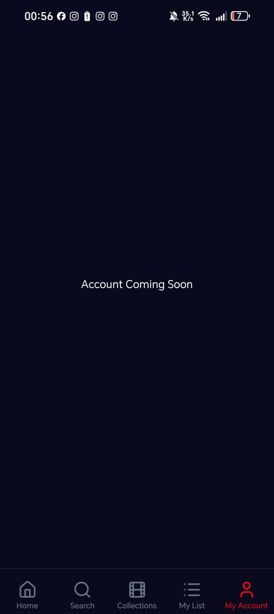
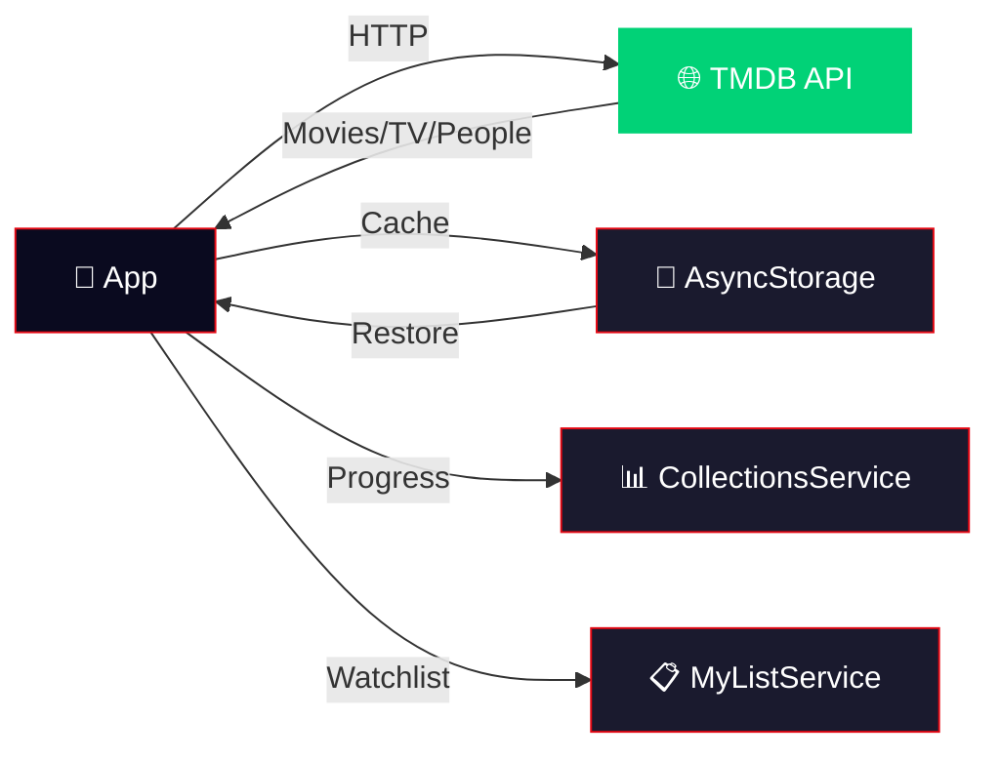

<div align="center">

<!-- Wave Header -->


<!-- Official Logo -->
<br/>

<br/>
<sub><strong>Your Premium Movie & TV Companion</strong></sub>
<br/><br/>

<!-- Dynamic Typing SVG -->
<a href="#">
  
</a>

<br/>

<!-- Badges Row 1 -->
[](https://reactnative.dev/)
[](https://expo.dev/)
[](https://www.typescriptlang.org/)
[](https://www.nativewind.dev/)

<!-- Badges Row 2 -->
[](https://www.themoviedb.org/)
[]()
[](LICENSE)
[](CONTRIBUTING.md)

<br/>

<!-- Quick Preview Banner -->
<table>
<tr>
<td align="center"><strong>🏠 Home</strong></td>
<td align="center"><strong>🎬 Collections</strong></td>
<td align="center"><strong>🔍 Search</strong></td>
<td align="center"><strong>📋 My List</strong></td>
<td align="center"><strong>🎥 Detail</strong></td>
</tr>
<tr>
<td></td>
<td></td>
<td></td>
<td></td>
<td></td>
</tr>
</table>


</div>

---

<!-- About Section -->

##  &nbsp;About The Project

**CINEFLIX Mobile** is a premium, feature-rich movie and TV show companion app built with **React Native** and **Expo**. It delivers a Netflix-inspired experience with a stunning deep navy glassmorphism UI, infinite collection discovery, and comprehensive movie/TV show tracking.

> 🎯 **Not just another movie app** — CINEFLIX goes beyond browsing. With smart collection discovery, marathon tracking, and a curated experience powered by TMDB's extensive database, it's your personal cinematic universe in your pocket.

<details>
<summary><strong>🤔 Why CINEFLIX?</strong></summary>

<br/>

| Problem | CINEFLIX Solution |
|---------|------------------|
| 🔍 Hard to find movie collections | Infinite scroll discovery of **6,400+** TMDB collections |
| 📊 No progress tracking | Track watched films, marathon progress, completion % |
| 🎨 Boring interfaces | Premium glassmorphism UI with smooth animations |
| 🗂️ No organization | Smart genre-based filtering (16 categories) |
| 📱 Web-only experience | Full native mobile app with haptic feedback |

</details>

---

## ✨ Features

<div align="center">

```
┌─────────────────────────────────────────────────────────┐
│                    🎬 CINEFLIX MOBILE                    │
├─────────────────────────────────────────────────────────┤
│                                                         │
│  🏠 HOME          │  📚 COLLECTIONS   │  🔍 SEARCH     │
│  ├─ Hero Carousel │  ├─ Infinite Scroll│  ├─ Multi-type │
│  ├─ Trending      │  ├─ 16 Genre Filters │ ├─ Debounced│
│  ├─ Categories    │  ├─ 6,400+ Results │  └─ History   │
│  └─ Skeleton Load │  └─ Detail View   │               │
│                   │                    │               │
│  📋 MY LIST       │  👤 ACCOUNT       │  🎥 DETAILS   │
│  ├─ Watchlist     │  ├─ Profile       │  ├─ Movie/TV  │
│  ├─ Favorites     │  └─ Settings      │  ├─ Cast/Crew │
│  └─ Filters       │                   │  ├─ Trailers  │
│                   │                   │  └─ Similar    │
│                                                         │
└─────────────────────────────────────────────────────────┘
```

</div>

### 🏠 Home Screen
- **Auto-rotating hero carousel** with backdrop images, logos, and gradient overlays
- **Category rows** — Trending, Popular, Top Rated, Now Playing, Upcoming
- **Smart recommendations** with enhanced similarity algorithms
- **Shimmer skeleton loaders** for premium loading experience
- **Pull-to-refresh** for latest content updates

### 📚 Collections — *The Star Feature*
- **Infinite scroll discovery** of **6,400+** TMDB collections
- **16 genre filter chips** — Action, Sci-Fi, Fantasy, Horror, Animation, Comedy, Drama, and more
- **Paginated fetching** — parallel API batch loading for instant results
- **Collection detail pages** with progress tracking, film lists, and stats dashboards
- **Smart deduplication** across pages with `seenCollectionIds` tracking
- **Search** collections across TMDB's entire database

### 🔍 Search
- **Multi-type search** — Movies, TV Shows, and People in one query
- **Debounced input** to minimize API calls
- **Genre-based browsing** with curated category grids
- **Trending content** as default suggestions

### 📋 My List
- **Watchlist management** — Add/remove movies and TV shows
- **Filter chips** — All, Movies, TV Shows
- **Persistent storage** with AsyncStorage
- **Long-press preview** modal with movie details

### 🎥 Detail Pages
- **Full-screen hero** with backdrop and gradient overlay
- **Cast & Crew** sections with actor filmographies
- **Video trailers** with in-app YouTube player
- **Similar & Recommended** content
- **External links** to IMDb, TMDB, and more

---

## 🎨 Design System

<div align="center">

| Token | Value | Usage |
|-------|-------|-------|
| 🌙 **Background** | `#0A0A1F` | Deep navy — all screens |
| 🔴 **Accent** | `#E50914` | CTAs, active states, badges |
| 🪟 **Glass BG** | `rgba(255,255,255,0.06)` | Cards, inputs, chips |
| 🔲 **Glass Border** | `rgba(255,255,255,0.1)` | Glassmorphism edges |
| 📝 **Text Primary** | `#FFFFFF` | Headers, titles |
| 📝 **Text Secondary** | `#9CA3AF` | Body text, stats |
| 📝 **Text Muted** | `#6B7280` | Hints, labels |

</div>

> **Design Philosophy:** Deep navy glassmorphism throughout — every card, input, chip, and modal uses translucent backgrounds with subtle borders creating a unified, premium feel across all screens.

---

## 🛠️ Tech Stack

<div align="center">

<!-- Skill Icons -->
<a href="https://skillicons.dev">
  
</a>

<br/><br/>

</div>

| Layer | Technology | Version | Purpose |
|-------|-----------|---------|---------|
| **Framework** | React Native | 0.81.5 | Cross-platform mobile |
| **Platform** | Expo | 54 | Development & build tooling |
| **Language** | TypeScript | 5.9 | Type safety |
| **Styling** | NativeWind (Tailwind) | 4.2 | Utility-first styling |
| **Navigation** | Expo Router | 6.0 | File-based routing |
| **Animations** | Reanimated | 4.1 | Smooth 60fps animations |
| **Icons** | Lucide React Native | 0.562 | Consistent iconography |
| **Gradients** | Expo Linear Gradient | 15.0 | Visual effects |
| **HTTP** | Axios | 1.13 | API communication |
| **Storage** | AsyncStorage | 2.2 | Local data persistence |
| **Video** | YouTube iFrame | 2.4 | In-app trailer playback |
| **API** | TMDB API v3 | Latest | Movie & TV data source |

---

## 📁 Project Architecture

```
cineflix-mobile/
├── 📱 app/                          # Expo Router screens
│   ├── _layout.tsx                  # Root layout (deep navy theme)
│   ├── index.tsx                    # Splash / Welcome screen
│   ├── (tabs)/                      # Tab navigation
│   │   ├── _layout.tsx              # Tab bar config (glassmorphism)
│   │   ├── index.tsx                # 🏠 Home screen
│   │   ├── search.tsx               # 🔍 Search screen
│   │   ├── collections.tsx          # 📚 Collections (infinite scroll)
│   │   ├── my-list.tsx              # 📋 My List
│   │   └── account.tsx              # 👤 Account
│   ├── movie/[id].tsx               # 🎥 Movie detail
│   ├── tv/[id].tsx                  # 📺 TV Show detail
│   ├── collection/[id].tsx          # 📚 Collection detail
│   ├── person/[id].tsx              # 🧑 Actor/Person detail
│   └── genre/[id].tsx               # 🏷️ Genre browse
│
├── 🧩 components/                   # Reusable UI components
│   ├── Collections/                 # Collection-specific components
│   │   ├── CollectionsHero.tsx       # Full-width hero section
│   │   ├── FranchiseCard.tsx         # Grid card component
│   │   ├── CategoryRow.tsx           # Horizontal scroll row
│   │   ├── FilterChips.tsx           # Genre filter pills
│   │   ├── CollectionsSkeleton.tsx   # Loading skeleton
│   │   └── CollectionFilmCard.tsx    # Film list item
│   ├── MyList/                      # My List components
│   ├── HomeScreenSkeleton.tsx       # Home loading state
│   ├── SkeletonLoader.tsx           # Detail loading states
│   └── LongPressPreviewModal.tsx    # Preview overlay
│
├── ⚙️ services/                     # Business logic & API
│   ├── tmdb.ts                      # TMDB API client (2,400+ lines)
│   ├── collectionsService.ts        # Collection progress tracking
│   ├── myListService.ts             # Watchlist management
│   ├── watchService.ts              # Watch history
│   ├── logoCache.ts                 # Image caching
│   ├── hooks/
│   │   ├── useCollections.ts        # Collections state management
│   │   └── useMyList.ts             # My List hook
│   └── ...streaming services
│
├── 📐 types/                        # TypeScript definitions
│   └── index.ts                     # All app types (390+ lines)
│
└── 🎨 tailwind.config.js            # Design tokens & theme
```

---

## 🚀 Getting Started

### Prerequisites

| Tool | Version | Install |
|------|---------|---------|
| **Node.js** | ≥ 18.x | [nodejs.org](https://nodejs.org/) |
| **npm** | ≥ 9.x | Comes with Node.js |
| **Expo CLI** | Latest | `npm install -g expo-cli` |
| **TMDB API Key** | Free | [tmdb.org/settings/api](https://www.themoviedb.org/settings/api) |

### Installation

```bash
# 1. Clone the repository
git clone https://github.com/yourusername/cineflix-mobile.git
cd cineflix-mobile

# 2. Install dependencies
npm install

# 3. Configure environment
cp .env.example .env
# Edit .env and add your TMDB API key:
# EXPO_PUBLIC_TMDB_API_KEY=your_api_key_here

# 4. Start the development server
npx expo start
```

### Running on Device

```bash
# Android
npx expo start --android

# iOS
npx expo start --ios

# Web (experimental)
npx expo start --web
```

> 💡 **Tip:** Install [Expo Go](https://expo.dev/client) on your phone and scan the QR code for instant testing!

---

## 🔑 Environment Variables

| Variable | Required | Description |
|----------|----------|-------------|
| `EXPO_PUBLIC_TMDB_API_KEY` | ✅ | Your TMDB API v3 key |

<details>
<summary><strong>📝 How to get a TMDB API Key</strong></summary>

1. Create a free account at [themoviedb.org](https://www.themoviedb.org/)
2. Go to **Settings** → **API**
3. Request an API key (select "Developer" option)
4. Copy your **API Key (v3 auth)**
5. Add it to your `.env` file

</details>

---

## 📊 API & Data Flow



### Collection Discovery Flow

```
User opens Collections Tab
        │
        ▼
┌─────────────────────────┐
│ Fetch 5 pages of        │
│ /discover/movie         │  ← 5 parallel API calls
│ sorted by popularity    │
└───────────┬─────────────┘
            │
            ▼
┌─────────────────────────┐
│ For each page:          │
│ 20 movies → parallel    │  ← 100 parallel /movie/{id} calls
│ /movie/{id} detail      │
└───────────┬─────────────┘
            │
            ▼
┌─────────────────────────┐
│ Extract unique          │
│ belongs_to_collection   │  ← Deduplicate with seenIds
│ IDs                     │
└───────────┬─────────────┘
            │
            ▼
┌─────────────────────────┐
│ Parallel fetch          │
│ /collection/{id}        │  ← Lightweight (no per-film details)
│ for new IDs             │
└───────────┬─────────────┘
            │
            ▼
   🎬 Display instantly!
   Scroll for more → repeat
```

---

## 🏗️ Key Implementation Details

<details>
<summary><strong>⚡ Performance Optimizations</strong></summary>

- **Parallel API batching** — Up to 20 concurrent requests per scroll page
- **Lightweight collection fetch** — `getCollectionDetailsLight()` uses 1 API call vs N+1
- **Deduplication tracking** — `seenCollectionIds` Set prevents redundant fetches
- **Image caching** — `logoCache` service for logo persistence
- **Debounced search** — 400ms delay to reduce API pressure
- **FlatList virtualization** — Only renders visible items
- **Skeleton loaders** — Perceived performance with shimmer animations

</details>

<details>
<summary><strong>🎨 Glassmorphism System</strong></summary>

Every interactive element uses the same glassmorphism formula:

```typescript
// Card / Container
backgroundColor: 'rgba(255,255,255,0.04)',    // 4% white
borderColor: 'rgba(255,255,255,0.06)',         // 6% white border
borderWidth: 1,
borderRadius: 14,

// Input / Chip
backgroundColor: 'rgba(255,255,255,0.06)',    // 6% white
borderColor: 'rgba(255,255,255,0.1)',          // 10% white border

// Active / Hover
backgroundColor: '#E50914',                    // Solid red accent
borderColor: '#E50914',
```

</details>

<details>
<summary><strong>🔄 State Management</strong></summary>

- **Custom Hooks** — `useCollections`, `useMyList` for domain-specific state
- **Service Layer** — `CollectionsService`, `MyListService`, `WatchService`
- **AsyncStorage** — Persistent data for lists, progress, and cache
- **In-memory Cache** — `discoveryCache` for fast collection reloads

</details>

---

## 📱 Screens Overview

| # | Screen | Route | Key Features |
|---|--------|-------|-------------|
| 1 | **Home** | `/(tabs)/` | Hero carousel, category rows, skeleton loading |
| 2 | **Search** | `/(tabs)/search` | Multi-type search, genre grid, trending |
| 3 | **Collections** | `/(tabs)/collections` | Infinite scroll, 16 genre filters, hero |
| 4 | **My List** | `/(tabs)/my-list` | Watchlist, favorites, filter chips |
| 5 | **Account** | `/(tabs)/account` | User profile and settings |
| 6 | **Movie Detail** | `/movie/[id]` | Backdrop, cast, trailers, recommendations |
| 7 | **TV Detail** | `/tv/[id]` | Seasons, episodes, cast, similar shows |
| 8 | **Collection Detail** | `/collection/[id]` | Film list, progress, stats dashboard |
| 9 | **Person** | `/person/[id]` | Biography, filmography, photos |
| 10 | **Genre** | `/genre/[id]` | Paginated genre browsing |

---

## 🤝 Contributing

Contributions are welcome! Here's how:

```bash
# 1. Fork the project
# 2. Create your feature branch
git checkout -b feature/amazing-feature

# 3. Commit your changes
git commit -m 'feat: add amazing feature'

# 4. Push to the branch
git push origin feature/amazing-feature

# 5. Open a Pull Request
```

### Commit Convention

| Prefix | Usage |
|--------|-------|
| `feat:` | New feature |
| `fix:` | Bug fix |
| `ui:` | Visual change |
| `refactor:` | Code improvement |
| `docs:` | Documentation |
| `perf:` | Performance |

---

## 📄 License

Distributed under the **MIT License**. See `LICENSE` for more information.

---

## 🙏 Acknowledgements

<div align="center">

| Resource | Purpose |
|----------|---------|
| [TMDB](https://www.themoviedb.org/) | Movie & TV Show database |
| [Expo](https://expo.dev/) | React Native framework |
| [NativeWind](https://www.nativewind.dev/) | Tailwind CSS for RN |
| [Lucide Icons](https://lucide.dev/) | Beautiful icon set |
| [React Native Reanimated](https://docs.swmansion.com/react-native-reanimated/) | Smooth animations |

</div>

---

<div align="center">

<!-- Footer Wave -->


<br/>

**Built with ❤️ and React Native**

<br/>

[](https://github.com/simoabid/cineflix-mobile)
&nbsp;&nbsp;
[](https://github.com/simoabid)

<br/>

<sub>If you found this useful, please consider giving it a ⭐!</sub>

</div>
